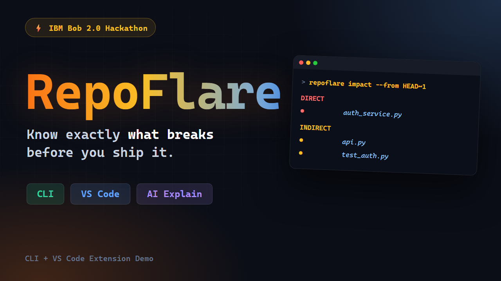

# RepoFlare

Repository intelligence: a structured, incrementally-maintained knowledge graph of a codebase, used for change-impact analysis and AI-assisted reasoning — CLI + VS Code extension over a shared Python core.



---

## 🎯 What Problem RepoFlare Solves

When developers make changes to a codebase, understanding the downstream impact across files, functions, classes, and tests is challenging. Developers typically grep, guess, or rely on failing CI pipelines to identify what broke.

Standard AI coding assistants have a similar blind spot: they re-read or re-embed entire codebases from scratch on every query. This approach is:
- **Slow & Expensive:** Re-sending large code chunks to LLMs on every query wastes tokens and causes latency.
- **Unverifiable:** LLMs make assertions about codebase impact without provable structural citations.

### The RepoFlare Solution

RepoFlare builds a structured, queryable knowledge graph of a repository stored locally in an embedded **DuckDB** database. It explicitly separates structural traversal from semantic reasoning:

1. **Deterministic Impact Traversal (Zero AI Cost):** Walks the dependency graph backwards from changed git diffs to identify affected symbols and tests in milliseconds. It requires no network calls, costs $0 in API usage, and returns categorized results (`DIRECT`, `INDIRECT`, `RELATED`, `POSSIBLE`).
2. **Cited AI Explanations:** When semantic explanation is requested, RepoFlare sends **only** a bounded, graph-selected context package to the LLM. Every statement in the response requires explicit line-level citations (e.g., `[utils.py#L1-L3]`), giving developers full traceability.

---

## 🤖 How IBM Bob Was Used

**IBM Bob 2.0** was utilized as an autonomous implementation agent to develop two core, production-grade components of RepoFlare based on architectural specifications:

### 1. VS Code Extension Shell (`extension/`)
- **What Bob built:** Implemented the complete VS Code extension layer in TypeScript—including the `RepoFlareRpcClient` communicating via JSON-RPC 2.0 over stdio with the Python backend (`rpc.ts`), extension host command registration (`extension.ts`), webview panel state manager (`panel.ts`), and the responsive webview UI renderer (`webview.ts`).
- **Review & Refinement:** We verified Bob's RPC implementation, corrected a webview message-type handler for back-navigation, and authored an extensive test suite (`extension/test/`) including integration tests that spawn the actual Python RPC subprocess.

### 2. DuckDB Query Caching Module (`core/src/repoflare_core/cache/`)
- **What Bob built:** Created the `CacheProvider` (`cache/provider.py`) backed by the `analysis_cache` DuckDB table. It uses stable content-hash cache keys based on prompt inputs to allow repeated queries on unchanged code to bypass LLM API calls completely.
- **Review & Refinement:** Verified connection handling to ensure database locks are freed before making network calls, and validated Bob's 10 unit tests covering TTL expiration, cache hits, and cache misses.

*(Full task briefs, IBM Bob session summaries, and task screenshots are preserved in `bob_sessions/`).*

---

## 🚀 How to Run the Project

### Prerequisites
- **Python 3.11+**
- [**`uv`**](https://docs.astral.sh/uv/) (Python package and venv manager)
- **Node.js 18+** & **npm** (required for VS Code extension)
- **Git**

---

### 1. Set Up the Python Core

```bash
cd core
uv sync
```

#### Optional: Configure AI Provider for Explanations
To enable the AI-powered `explain` command, set your API key:
```bash
cp ../.env.example ../.env
# Edit ../.env and add your GEMINI_API_KEY or OPENROUTER_API_KEY
```
*(Note: `init`, `analyze`, `status`, `impact`, and `export-html` are 100% deterministic and do not require an API key).*

---

### 2. Run via CLI

You can point RepoFlare at any git repository (including itself):

```bash
# Initialize and analyze a repository
uv run repoflare init <path-to-repo>
uv run repoflare analyze <path-to-repo>
uv run repoflare status <path-to-repo>

# Deterministic change-impact analysis (between git refs)
uv run repoflare impact --from HEAD~1 --to HEAD <path-to-repo>

# Grounded AI explanation with citations (requires API key)
uv run repoflare explain --from HEAD~1 --to HEAD <path-to-repo>

# Export a shareable static HTML report
uv run repoflare export-html --from HEAD~1 --to HEAD --output report.html <path-to-repo>
```

#### Run Core Tests
```bash
cd core
uv run pytest -q
```

---

### 3. Run the VS Code Extension

```bash
cd extension
npm install
npm run build
```

1. Open the `extension/` folder in VS Code (or a compatible editor like Antigravity IDE / Cursor).
2. Press **`F5`** to launch a new window titled `[Extension Development Host]`.
3. In the **Extension Development Host** window, open the target repository folder.
4. Open the **Command Palette** (`Ctrl+Shift+P` / `Cmd+Shift+P`) and run:
   - `RepoFlare: Analyze Repository`
   - `RepoFlare: Show Repository Overview`
   - `RepoFlare: Show Impact for Ref Range…`
   - `RepoFlare: Show Interactive Dependency Graph`

#### Run Extension Tests
```bash
cd extension
npm test
```

---

### 4. Hosted Web API (the live demo URL)

The same Python core also serves an HTTP API, and that is what gets deployed for the hackathon's
required **Demo Application URL**. A hosted process can't read your disk, so it clones a public
GitHub repository on demand and runs the identical `init → analyze → impact` pipeline on it.

```bash
cd core
uv run python -m repoflare_core.api     # then open http://127.0.0.1:8000/
```

| Endpoint | Returns |
| --- | --- |
| `GET /` | The demo page (a plain GET form, no JavaScript) |
| `GET /healthz` | Liveness probe |
| `GET /api/v1/analyze?repo=owner/name` | Snapshot plus file/symbol/test/edge counts |
| `GET /api/v1/impact?repo=&from=REF&to=REF` | Changed files and affected nodes by category |
| `GET /api/v1/explain?repo=&from=REF&to=REF` | Grounded AI explanation (needs an API key) |
| `GET /report?repo=&from=REF&to=REF` | Standalone HTML report |

**Deploying to Render (free plan):** `render.yaml` at the repo root is a Render Blueprint that
runs the command above on Render's free instance type (0.1 CPU / 512 MB). In the
[Render Dashboard](https://dashboard.render.com) choose **New → Blueprint**, select
`Tahleels/repoflare`, and apply — Render builds with `uv sync --frozen --no-dev` and
health-checks `/healthz`. The `sync: false` API keys are prompted for in the dashboard and are
never stored in this repo. Full details, including what the free plan's spin-down and ephemeral
filesystem mean for a live demo, are in [`HOW_TO_RUN.md`](HOW_TO_RUN.md) §4.

---

## 📚 Documentation Links

- **Plain Words Overview:** [`PROJECT_OVERVIEW.md`](PROJECT_OVERVIEW.md)
- **Detailed Run Instructions:** [`HOW_TO_RUN.md`](HOW_TO_RUN.md)
- **Testing Walkthrough:** [`TESTING_GUIDE.md`](TESTING_GUIDE.md)
- **Architecture & System Design:** [`docs/ARCHITECTURE.md`](docs/ARCHITECTURE.md) | [`docs/ARCHITECTURE_SIMPLE.md`](docs/ARCHITECTURE_SIMPLE.md)
- **Data & Graph Models:** [`docs/DATA_MODEL.md`](docs/DATA_MODEL.md) | [`docs/GRAPH_MODEL.md`](docs/GRAPH_MODEL.md)
- **Hackathon Demo Script:** [`docs/DEMO_SCRIPT.md`](docs/DEMO_SCRIPT.md)

